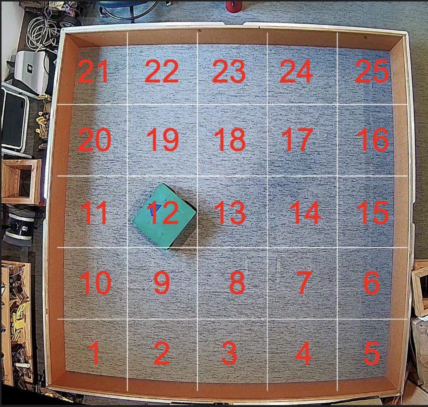
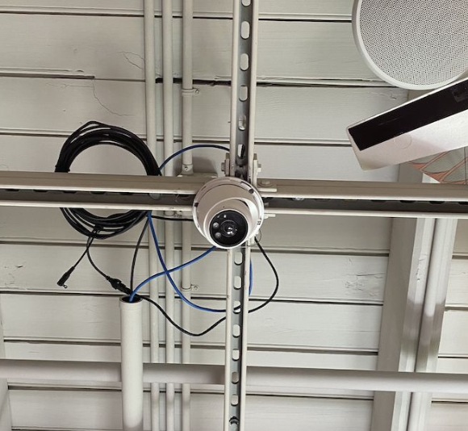
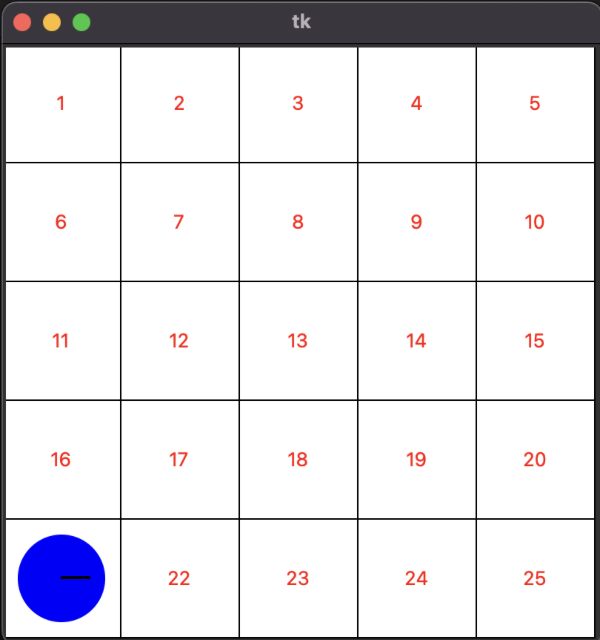

# Punctuated Anytime Learning on a Real Robot

Faiz Aladin, Jim O'Connor

Connecticut College

  

This repository implements **Punctuated Anytime Learning (PAL)** to teach a 4-wheeled real-world robot how to effectively cover an area using a **Cyclic Genetic Algorithm (CGA)**.

The system trains a robot in an offline simulation to perform a "snake" coverage pattern. It periodically "punctuates" the learning process by validating the best evolving solution on the physical robot to correct simulation biases.

---

### Vision System
The robot uses an offboard camera to track its movement and assist with positioning.

  

---

### Simulation & Training
The core learning happens in an offline simulation to speed up the evolutionary process. The results are then transferred to the real robot to bridge the reality gap.

  

---

### Automated Reset
We have implemented a reset function to have the robot return to the start position automatically. This ensures the entire training process is end-to-end.

https://github.com/user-attachments/assets/09d8d62e-7017-4d3c-8e16-91f6aca54ca8

